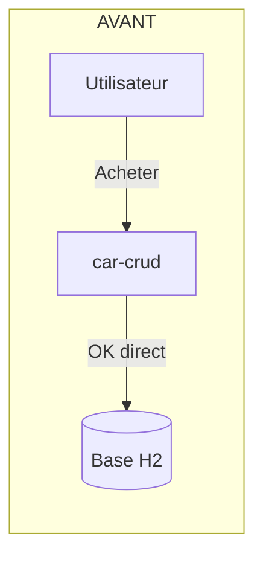
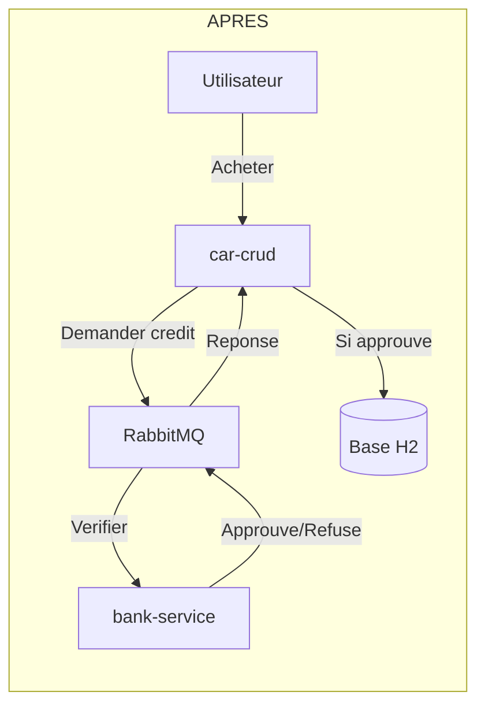
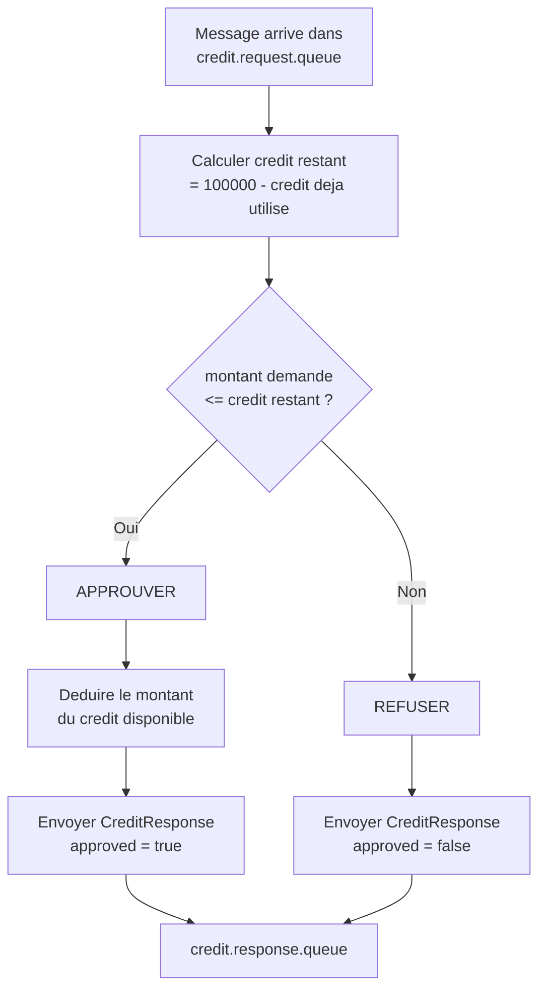
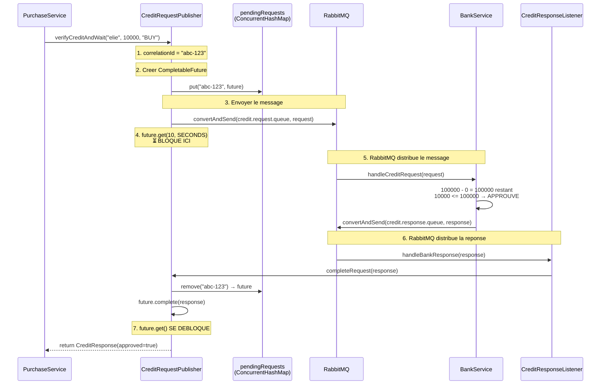
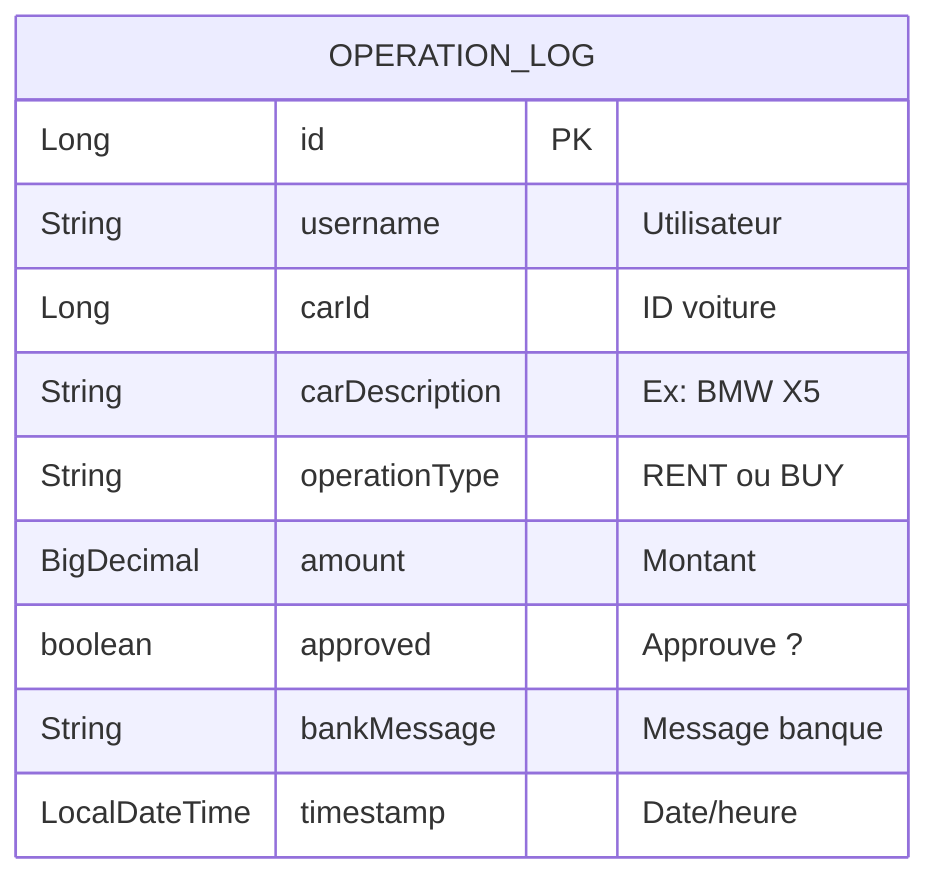
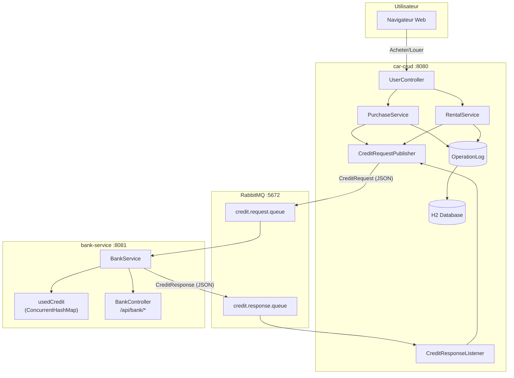
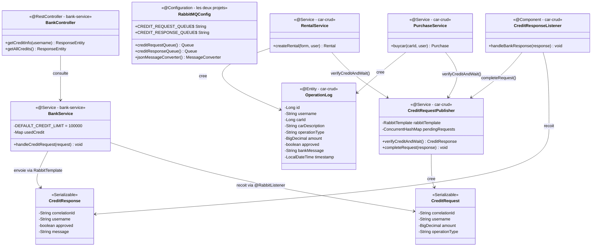

# RabbitMQ — Guide complet d'implementation

## Sommaire

1. [Le besoin](#1-le-besoin)
2. [Installer RabbitMQ](#2-installer-rabbitmq)
3. [Creer le projet bank-service](#3-creer-le-projet-bank-service)
4. [Integrer RabbitMQ dans car-crud](#4-integrer-rabbitmq-dans-car-crud)
5. [Connecter les deux services](#5-connecter-les-deux-services)
6. [Ajouter le journal des operations](#6-ajouter-le-journal-des-operations)
7. [Ajouter l'API REST](#7-ajouter-lapi-rest)
8. [Tester l'ensemble](#8-tester-lensemble)
9. [Architecture finale](#9-architecture-finale)

---

## 1. Le besoin

Avant RabbitMQ, l'application `car-crud` permettait d'acheter et louer des voitures **sans aucune verification**. N'importe quel utilisateur pouvait acheter autant de voitures qu'il voulait.

**Objectif** : Ajouter un service bancaire externe qui verifie si l'utilisateur a assez de credit avant chaque achat/location.

**Probleme** : Les deux applications (car-crud et bank-service) sont des **microservices independants** — elles ne partagent pas la meme base de donnees ni la meme memoire. Il faut un moyen de communiquer entre elles.

**Solution** : Utiliser **RabbitMQ** comme intermediaire de messages.





### Pourquoi RabbitMQ et pas un appel HTTP direct ?

| Appel HTTP direct | RabbitMQ |
|---|---|
| Si bank-service est down → erreur immediate | Le message attend dans la queue → traite quand le service revient |
| Couplage fort entre les services | Couplage faible — chaque service ne connait que les queues |
| Synchrone uniquement | Supporte l'asynchrone et le synchrone |
| Pas de garantie de livraison | Messages durables — survivent a un redemarrage |

---

## 2. Installer RabbitMQ

RabbitMQ est un **broker de messages** — un serveur intermediaire qui recoit, stocke et distribue les messages entre applications.

### Avec Docker (recommande)

```bash
docker run -d --name rabbitmq -p 5672:5672 -p 15672:15672 rabbitmq:management
```

| Port | Utilisation |
|------|-------------|
| 5672 | Port AMQP (communication entre les applications) |
| 15672 | Console web d'administration |

### Verifier l'installation

Ouvrir http://localhost:15672 dans le navigateur :
- **Username** : guest
- **Password** : guest

On voit le dashboard RabbitMQ. Pour l'instant, aucune queue n'existe — elles seront creees automatiquement au demarrage des applications.

---

## 3. Creer le projet bank-service

### Etape 3.1 — Generer le projet

Creer un nouveau projet Spring Boot avec les dependances :
- `spring-boot-starter-web` (API REST)
- `spring-boot-starter-amqp` (RabbitMQ)
- `spring-boot-starter-actuator` (monitoring)

**`pom.xml`** :

```xml
<parent>
    <groupId>org.springframework.boot</groupId>
    <artifactId>spring-boot-starter-parent</artifactId>
    <version>3.2.5</version>
</parent>

<dependencies>
    <dependency>
        <groupId>org.springframework.boot</groupId>
        <artifactId>spring-boot-starter-web</artifactId>
    </dependency>
    <dependency>
        <groupId>org.springframework.boot</groupId>
        <artifactId>spring-boot-starter-amqp</artifactId>
    </dependency>
    <dependency>
        <groupId>org.springframework.boot</groupId>
        <artifactId>spring-boot-starter-actuator</artifactId>
    </dependency>
</dependencies>
```

### Etape 3.2 — Configurer la connexion RabbitMQ

**`application.properties`** :

```properties
spring.application.name=bank-service
server.port=8081

# Connexion a RabbitMQ
spring.rabbitmq.host=localhost
spring.rabbitmq.port=5672
spring.rabbitmq.username=guest
spring.rabbitmq.password=guest
```

> **Important** : `server.port=8081` car `car-crud` utilise deja le port 8080.

### Etape 3.3 — Declarer les queues

On cree une classe de configuration qui declare les deux queues RabbitMQ et le format des messages (JSON).

**`config/RabbitMQConfig.java`** :

```java
@Configuration
public class RabbitMQConfig {

    // Noms des queues — doivent etre identiques dans les deux projets
    public static final String CREDIT_REQUEST_QUEUE = "credit.request.queue";
    public static final String CREDIT_RESPONSE_QUEUE = "credit.response.queue";

    // Declarer la queue des demandes (durable = survit au redemarrage de RabbitMQ)
    @Bean
    public Queue creditRequestQueue() {
        return new Queue(CREDIT_REQUEST_QUEUE, true);
    }

    // Declarer la queue des reponses
    @Bean
    public Queue creditResponseQueue() {
        return new Queue(CREDIT_RESPONSE_QUEUE, true);
    }

    // Utiliser JSON pour serialiser/deserialiser les messages
    // Sans ca, RabbitMQ enverrait des objets Java serialises (illisible et fragile)
    @Bean
    public MessageConverter jsonMessageConverter() {
        return new Jackson2JsonMessageConverter();
    }
}
```

### Etape 3.4 — Creer les DTOs (objets de message)

Ce sont les objets qui transitent par RabbitMQ. Ils doivent etre `Serializable` et avoir un **constructeur vide** (pour la deserialisation JSON).

**`model/CreditRequest.java`** — Ce que car-crud envoie :

```java
public class CreditRequest implements Serializable {

    private String correlationId;   // UUID unique pour matcher requete ↔ reponse
    private String username;        // Qui demande le credit
    private BigDecimal amount;      // Combien
    private String operationType;   // "RENT" ou "BUY"

    public CreditRequest() {} // Obligatoire pour Jackson (deserialisation JSON)

    // getters + setters
}
```

**`model/CreditResponse.java`** — Ce que bank-service renvoie :

```java
public class CreditResponse implements Serializable {

    private String correlationId;   // Meme UUID que la requete (pour la matcher)
    private String username;        // Qui a demande
    private boolean approved;       // true = approuve, false = refuse
    private String message;         // Details ("Remaining: 5000 EUR" ou "Insufficient credit")

    public CreditResponse() {}

    public CreditResponse(String correlationId, String username, boolean approved, String message) {
        this.correlationId = correlationId;
        this.username = username;
        this.approved = approved;
        this.message = message;
    }

    // getters + setters
}
```

### Etape 3.5 — Implementer la logique bancaire

C'est le coeur du bank-service. Il ecoute la queue `credit.request.queue`, verifie le credit, et repond sur `credit.response.queue`.

**`service/BankService.java`** :

```java
@Service
public class BankService {

    // Chaque utilisateur a une limite de 100 000 EUR
    private static final BigDecimal DEFAULT_CREDIT_LIMIT = new BigDecimal("100000");

    // Stocke le credit deja utilise par chaque utilisateur (en memoire)
    // ConcurrentHashMap = thread-safe (plusieurs requetes en parallele)
    private final Map<String, BigDecimal> usedCredit = new ConcurrentHashMap<>();

    private final RabbitTemplate rabbitTemplate;

    public BankService(RabbitTemplate rabbitTemplate) {
        this.rabbitTemplate = rabbitTemplate;
    }

    // @RabbitListener = cette methode est appelee AUTOMATIQUEMENT
    // chaque fois qu'un message arrive dans credit.request.queue
    @RabbitListener(queues = RabbitMQConfig.CREDIT_REQUEST_QUEUE)
    public void handleCreditRequest(CreditRequest request) {

        // Combien cet utilisateur a deja depense
        BigDecimal alreadyUsed = usedCredit.getOrDefault(request.getUsername(), BigDecimal.ZERO);

        // Combien il lui reste
        BigDecimal remaining = DEFAULT_CREDIT_LIMIT.subtract(alreadyUsed);

        CreditResponse response;

        if (request.getAmount().compareTo(remaining) <= 0) {
            // CAS 1 : Le montant demande est inferieur ou egal au credit restant
            // → APPROUVER et deduire le montant
            usedCredit.put(request.getUsername(), alreadyUsed.add(request.getAmount()));

            response = new CreditResponse(
                    request.getCorrelationId(),
                    request.getUsername(),
                    true,  // approuve
                    "Credit approved. Remaining: "
                            + remaining.subtract(request.getAmount()) + " EUR"
            );
        } else {
            // CAS 2 : Pas assez de credit
            // → REFUSER (on ne deduit rien)
            response = new CreditResponse(
                    request.getCorrelationId(),
                    request.getUsername(),
                    false, // refuse
                    "Insufficient credit. Available: " + remaining
                            + " EUR, requested: " + request.getAmount() + " EUR"
            );
        }

        // Envoyer la reponse sur la queue de reponse
        rabbitTemplate.convertAndSend(RabbitMQConfig.CREDIT_RESPONSE_QUEUE, response);
    }

    // Methodes utilitaires pour l'API REST
    public BigDecimal getCreditLimit() { return DEFAULT_CREDIT_LIMIT; }
    public BigDecimal getUsedCredit(String username) {
        return usedCredit.getOrDefault(username, BigDecimal.ZERO);
    }
    public BigDecimal getRemainingCredit(String username) {
        return DEFAULT_CREDIT_LIMIT.subtract(getUsedCredit(username));
    }
    public Map<String, BigDecimal> getAllUsedCredits() { return Map.copyOf(usedCredit); }
}
```

**Algorithme en schema** :



### Etape 3.6 — Ajouter l'API REST (optionnel)

Pour pouvoir consulter l'etat du credit depuis un navigateur ou un outil comme Postman.

**`controller/BankController.java`** :

```java
@RestController
@RequestMapping("/api/bank")
public class BankController {

    private final BankService bankService;

    public BankController(BankService bankService) {
        this.bankService = bankService;
    }

    // GET http://localhost:8081/api/bank/credit/elie
    // → {"username":"elie", "creditLimit":100000, "usedCredit":8000, "remainingCredit":92000}
    @GetMapping("/credit/{username}")
    public ResponseEntity<?> getCreditInfo(@PathVariable String username) {
        return ResponseEntity.ok(Map.of(
                "username", username,
                "creditLimit", bankService.getCreditLimit(),
                "usedCredit", bankService.getUsedCredit(username),
                "remainingCredit", bankService.getRemainingCredit(username)
        ));
    }

    // GET http://localhost:8081/api/bank/credits
    // → {"creditLimit":100000, "usedCredits":{"elie":8000,"john":0}}
    @GetMapping("/credits")
    public ResponseEntity<?> getAllCredits() {
        return ResponseEntity.ok(Map.of(
                "creditLimit", bankService.getCreditLimit(),
                "usedCredits", bankService.getAllUsedCredits()
        ));
    }
}
```

### Structure finale de bank-service

```
bank-service/
├── pom.xml
└── src/main/java/com/examples/bankservice/
    ├── BankServiceApplication.java      # Point d'entree Spring Boot
    ├── config/
    │   └── RabbitMQConfig.java          # Queues + JSON converter
    ├── model/
    │   ├── CreditRequest.java           # DTO recu
    │   └── CreditResponse.java          # DTO envoye
    ├── service/
    │   └── BankService.java             # @RabbitListener + logique credit
    └── controller/
        └── BankController.java          # API REST /api/bank/*
```

Le bank-service est **termine**. Maintenant, il faut modifier `car-crud` pour lui parler.

---

## 4. Integrer RabbitMQ dans car-crud

### Etape 4.1 — Ajouter la dependance Maven

Dans le `pom.xml` de `car-crud`, ajouter :

```xml
<dependency>
    <groupId>org.springframework.boot</groupId>
    <artifactId>spring-boot-starter-amqp</artifactId>
</dependency>
```

### Etape 4.2 — Configurer la connexion

Dans `application.properties` de car-crud, ajouter :

```properties
# RabbitMQ — meme serveur que bank-service
spring.rabbitmq.host=localhost
spring.rabbitmq.port=5672
spring.rabbitmq.username=guest
spring.rabbitmq.password=guest
```

### Etape 4.3 — Declarer les queues (identique a bank-service)

**`config/RabbitMQConfig.java`** dans car-crud :

```java
@Configuration
public class RabbitMQConfig {

    public static final String CREDIT_REQUEST_QUEUE = "credit.request.queue";
    public static final String CREDIT_RESPONSE_QUEUE = "credit.response.queue";

    @Bean
    public Queue creditRequestQueue() {
        return new Queue(CREDIT_REQUEST_QUEUE, true);
    }

    @Bean
    public Queue creditResponseQueue() {
        return new Queue(CREDIT_RESPONSE_QUEUE, true);
    }

    @Bean
    public MessageConverter jsonMessageConverter() {
        return new Jackson2JsonMessageConverter();
    }
}
```

> **Important** : Les noms des queues (`credit.request.queue` et `credit.response.queue`) doivent etre **exactement les memes** dans les deux projets. Sinon les messages n'arrivent jamais.

### Etape 4.4 — Creer les DTOs (identiques)

Copier les memes `CreditRequest` et `CreditResponse` dans `car-crud/dto/` :

```java
// dto/CreditRequest.java
public class CreditRequest implements Serializable {
    private String correlationId;
    private String username;
    private BigDecimal amount;
    private String operationType; // "RENT" ou "BUY"

    public CreditRequest() {}
    public CreditRequest(String correlationId, String username,
                         BigDecimal amount, String operationType) { ... }
    // getters + setters
}

// dto/CreditResponse.java
public class CreditResponse implements Serializable {
    private String correlationId;
    private String username;
    private boolean approved;
    private String message;

    public CreditResponse() {}
    public CreditResponse(String correlationId, String username,
                          boolean approved, String message) { ... }
    // getters + setters
}
```

> **Attention** : Les champs doivent avoir les **memes noms** dans les deux projets. C'est le JSON qui fait le lien — les noms de packages n'ont pas besoin d'etre identiques.

---

## 5. Connecter les deux services

C'est la partie la plus complexe. Le probleme :

```
RabbitMQ est ASYNCHRONE :
  → On envoie un message et on continue sans attendre.

Mais le controleur web est SYNCHRONE :
  → L'utilisateur clique "Acheter" et attend une reponse immediate.
```

**Solution** : Le pattern **Request-Reply** avec `CompletableFuture`.

### Etape 5.1 — `CreditRequestPublisher` (envoyer et attendre)

Ce service envoie un message a la banque et **bloque** en attendant la reponse (max 10 secondes).

**`service/CreditRequestPublisher.java`** :

```java
@Service
public class CreditRequestPublisher {

    private final RabbitTemplate rabbitTemplate;

    // Map qui stocke les requetes en attente de reponse
    // Cle = correlationId (UUID), Valeur = Future qui attend la reponse
    private final ConcurrentHashMap<String, CompletableFuture<CreditResponse>> pendingRequests
            = new ConcurrentHashMap<>();

    public CreditRequestPublisher(RabbitTemplate rabbitTemplate) {
        this.rabbitTemplate = rabbitTemplate;
    }

    /**
     * Envoie une demande de credit a la banque et attend la reponse.
     * Cette methode BLOQUE le thread appelant jusqu'a la reponse (ou timeout de 10s).
     */
    public CreditResponse verifyCreditAndWait(String username, BigDecimal amount,
                                               String operationType) {
        // 1. Generer un ID unique pour cette requete
        String correlationId = UUID.randomUUID().toString();

        // 2. Creer l'objet de requete
        CreditRequest request = new CreditRequest(correlationId, username, amount, operationType);

        // 3. Creer un "Future" = une promesse de reponse future
        //    C'est comme dire : "Je n'ai pas encore la reponse, mais quand elle arrivera,
        //    elle sera stockee ici"
        CompletableFuture<CreditResponse> future = new CompletableFuture<>();

        // 4. Stocker le Future dans la Map avec le correlationId comme cle
        //    Quand la reponse arrivera, on utilisera le correlationId pour retrouver
        //    quel Future completer
        pendingRequests.put(correlationId, future);

        // 5. Envoyer le message a RabbitMQ (non bloquant — retourne immediatement)
        rabbitTemplate.convertAndSend(RabbitMQConfig.CREDIT_REQUEST_QUEUE, request);

        try {
            // 6. BLOQUER ici en attendant que le Future soit complete
            //    Quand CreditResponseListener recevra la reponse, il appellera
            //    completeRequest() qui completera le Future, et cette ligne se debloquera
            //    Timeout de 10 secondes si la banque ne repond pas
            return future.get(10, TimeUnit.SECONDS);
        } catch (Exception e) {
            // Si timeout ou erreur, nettoyer la Map
            pendingRequests.remove(correlationId);
            throw new RuntimeException("Bank credit verification timed out or failed");
        }
    }

    /**
     * Appele par CreditResponseListener quand une reponse arrive de la banque.
     * Retrouve le Future correspondant et le complete, ce qui debloque
     * verifyCreditAndWait().
     */
    public void completeRequest(CreditResponse response) {
        // Retrouver le Future grace au correlationId et le retirer de la Map
        CompletableFuture<CreditResponse> future = pendingRequests.remove(
                response.getCorrelationId());
        if (future != null) {
            // Completer le Future = debloquer verifyCreditAndWait()
            future.complete(response);
        }
    }
}
```

### Etape 5.2 — `CreditResponseListener` (recevoir la reponse)

Ce composant ecoute la queue de reponse et transmet la reponse au publisher.

**`service/CreditResponseListener.java`** :

```java
@Component
public class CreditResponseListener {

    private final CreditRequestPublisher creditRequestPublisher;

    public CreditResponseListener(CreditRequestPublisher creditRequestPublisher) {
        this.creditRequestPublisher = creditRequestPublisher;
    }

    // Appele automatiquement quand un message arrive dans credit.response.queue
    @RabbitListener(queues = RabbitMQConfig.CREDIT_RESPONSE_QUEUE)
    public void handleBankResponse(CreditResponse response) {
        // Transmettre la reponse au publisher qui attend
        creditRequestPublisher.completeRequest(response);
    }
}
```

### Comment ca fonctionne ensemble — pas a pas



### Etape 5.3 — Modifier `PurchaseService` pour utiliser RabbitMQ

**Avant** (sans verification bancaire) :

```java
@Transactional
public Purchase buycar(Long carId, AppUser user) {
    Car car = carService.findById(carId).orElseThrow();
    if (car.isSold()) throw new RuntimeException("Car is already sold");

    // Achat direct, sans verification
    car.setSold(true);
    carService.save(car);
    // ... creer Purchase + PaymentRecord
}
```

**Apres** (avec verification bancaire via RabbitMQ) :

```java
@Transactional
public Purchase buycar(Long carId, AppUser user) {
    Car car = carService.findById(carId).orElseThrow();
    if (car.isSold()) throw new RuntimeException("Car is already sold");

    // NOUVEAU : Demander l'approbation de la banque via RabbitMQ
    CreditResponse bankResponse = creditRequestPublisher.verifyCreditAndWait(
            user.getUsername(), car.getPrice(), "BUY");

    // Si la banque refuse, on arrete tout
    if (!bankResponse.isApproved()) {
        throw new RuntimeException("Bank rejected: " + bankResponse.getMessage());
    }

    // Si approuve, continuer l'achat normalement
    car.setSold(true);
    carService.save(car);

    Purchase purchase = new Purchase();
    purchase.setUser(user);
    purchase.setCar(car);
    purchase.setPrice(car.getPrice());
    Purchase saved = purchaseRepository.save(purchase);

    // Auto-creer le PaymentRecord
    PaymentRecord payment = new PaymentRecord();
    payment.setCurrency("EUR");
    payment.setOwnerName(user.getFirstName() + " " + user.getLastName());
    payment.setIban("PURCHASE-" + saved.getId());
    payment.setAmount(car.getPrice());
    paymentRecordRepository.save(payment);

    return saved;
}
```

### Etape 5.4 — Modifier `RentalService` de la meme maniere

Le cout de location = **1% du prix de la voiture par jour**.

```java
public Rental createRental(RentalRequestForm form, AppUser user) {
    validateRentalRequest(form);
    Car car = carService.findById(form.getCarId()).orElseThrow();
    long days = ChronoUnit.DAYS.between(form.getStartDate(), form.getEndDate());

    // Calculer le cout de location
    BigDecimal rentalCost = car.getPrice()
            .multiply(BigDecimal.valueOf(days))
            .divide(BigDecimal.valueOf(100));
    // Ex: voiture a 10000 EUR, 5 jours → 10000 * 5 / 100 = 500 EUR

    // NOUVEAU : Verification bancaire via RabbitMQ
    CreditResponse bankResponse = creditRequestPublisher.verifyCreditAndWait(
            user.getUsername(), rentalCost, "RENT");

    if (!bankResponse.isApproved()) {
        throw new RuntimeException("Bank rejected: " + bankResponse.getMessage());
    }

    // Creer la location
    Rental rental = new Rental();
    rental.setUser(user);
    rental.setCar(car);
    rental.setStartDate(form.getStartDate());
    rental.setEndDate(form.getEndDate());
    rental.setDays((int) days);
    rental.setComment(form.getComment());
    rental.setStatus(RentalStatus.REQUESTED);
    return rentalRepository.save(rental);
}
```

---

## 6. Ajouter le journal des operations

Pour garder une trace de chaque verification bancaire (approuvee ou refusee), on cree une entite `OperationLog`.

### Etape 6.1 — Creer l'entite

**`model/OperationLog.java`** :

```java
@Entity
@Table(name = "operation_log")
public class OperationLog {

    @Id
    @GeneratedValue(strategy = GenerationType.IDENTITY)
    private Long id;

    @Column(nullable = false)
    private String username;          // Qui a fait la demande

    @Column(nullable = false)
    private Long carId;               // Quelle voiture

    private String carDescription;    // "BMW X5"

    @Column(nullable = false)
    private String operationType;     // "RENT" ou "BUY"

    @Column(precision = 10, scale = 2)
    private BigDecimal amount;        // Montant demande

    @Column(nullable = false)
    private boolean approved;         // Resultat de la banque

    private String bankMessage;       // Message de la banque

    private LocalDateTime timestamp;  // Quand

    @PrePersist
    public void prePersist() {
        if (timestamp == null) timestamp = LocalDateTime.now();
    }
    // getters + setters
}
```



### Etape 6.2 — Creer le repository

```java
public interface OperationLogRepository extends JpaRepository<OperationLog, Long> {
}
```

### Etape 6.3 — Logger dans les services

Dans `PurchaseService` et `RentalService`, **apres** la verification bancaire, on enregistre le resultat :

```java
// Apres avoir recu la reponse de la banque (approuvee OU refusee)
OperationLog log = new OperationLog();
log.setUsername(user.getUsername());
log.setCarId(carId);
log.setCarDescription(car.getBrand() + " " + car.getModel());
log.setOperationType("BUY");  // ou "RENT"
log.setAmount(car.getPrice()); // ou rentalCost
log.setApproved(bankResponse.isApproved());
log.setBankMessage(bankResponse.getMessage());
operationLogRepository.save(log);
// Le log est cree AVANT de verifier si c'est approuve ou refuse
// → on a une trace de TOUTES les demandes, pas seulement les reussies
```

---

## 7. Ajouter l'API REST

Pour consulter les logs d'operations et permettre des achats/locations via API.

**`controller/OperationApiController.java`** :

```java
@RestController
@RequestMapping("/api")
public class OperationApiController {

    private final PurchaseService purchaseService;
    private final RentalService rentalService;
    private final AppUserService appUserService;
    private final OperationLogRepository operationLogRepository;

    // POST /api/purchase/vehicle/5  → acheter la voiture #5
    @PostMapping("/purchase/vehicle/{id}")
    public ResponseEntity<?> purchaseVehicle(@PathVariable Long id, Principal principal) {
        AppUser user = appUserService.findByUsername(principal.getName());
        try {
            purchaseService.buycar(id, user);
            return ResponseEntity.ok(Map.of("status", "APPROVED"));
        } catch (RuntimeException e) {
            return ResponseEntity.badRequest().body(Map.of("status", "REJECTED",
                    "message", e.getMessage()));
        }
    }

    // POST /api/rental/vehicle/5?startDate=2025-06-01&endDate=2025-06-05
    @PostMapping("/rental/vehicle/{id}")
    public ResponseEntity<?> rentVehicle(@PathVariable Long id,
                                         @RequestParam String startDate,
                                         @RequestParam String endDate,
                                         @RequestParam(required = false) String comment,
                                         Principal principal) {
        // ... creer RentalRequestForm et appeler rentalService.createRental()
    }

    // GET /api/operations  → liste de tous les logs
    @GetMapping("/operations")
    public ResponseEntity<List<OperationLog>> listOperations() {
        return ResponseEntity.ok(operationLogRepository.findAll());
    }
}
```

---

## 8. Tester l'ensemble

### 8.1 — Demarrer les 3 services

```bash
# Terminal 1 : RabbitMQ
docker run -d --name rabbitmq -p 5672:5672 -p 15672:15672 rabbitmq:management

# Terminal 2 : Bank Service
cd bank-service
mvn spring-boot:run

# Terminal 3 : Car CRUD
cd car-crud
mvn spring-boot:run
```

### 8.2 — Tester un achat (via le navigateur)

1. Aller sur http://localhost:8080
2. Se connecter en tant que `elie` / `eliepass`
3. Aller sur "Buy a car"
4. Acheter la **Volkswagen Golf** (8 000 EUR) → **Succes** (reste 92 000 EUR de credit)
5. Acheter l'**Audi A6** (10 000 EUR) → **Succes** (reste 82 000 EUR de credit)

### 8.3 — Verifier dans la console RabbitMQ

Aller sur http://localhost:15672 → Queues :
- `credit.request.queue` : messages envoyes par car-crud
- `credit.response.queue` : messages renvoyes par bank-service

### 8.4 — Verifier le credit via l'API

```bash
curl http://localhost:8081/api/bank/credit/elie
```

Reponse :
```json
{
    "username": "elie",
    "creditLimit": 100000,
    "usedCredit": 8000,
    "remainingCredit": 92000
}
```

### 8.5 — Verifier les logs d'operations

```bash
curl http://localhost:8080/api/operations -u elie:eliepass
```

Reponse :
```json
[
    {
        "id": 1,
        "username": "elie",
        "carId": 3,
        "carDescription": "Volkswagen Golf",
        "operationType": "BUY",
        "amount": 8000,
        "approved": true,
        "bankMessage": "Credit approved. Remaining: 92000 EUR",
        "timestamp": "2025-06-01T14:30:00"
    },
    {
        "id": 2,
        "username": "elie",
        "carId": 1,
        "carDescription": "Audi A6",
        "operationType": "BUY",
        "amount": 10000,
        "approved": true,
        "bankMessage": "Credit approved. Remaining: 82000 EUR",
        "timestamp": "2025-06-01T14:31:00"
    }
]
```

### 8.6 — Exemple complet chiffre

| # | Utilisateur | Action | Montant | Credit utilise | Credit restant | Resultat |
|---|-------------|--------|---------|---------------|----------------|----------|
| 1 | elie | Acheter VW Golf | 8 000 | 0 → 8 000 | 92 000 | **APPROUVE** |
| 2 | elie | Louer Audi A6 (5j) | 500 | 8 000 → 8 500 | 91 500 | **APPROUVE** |
| 3 | elie | Acheter BMW X5 | 15 000 | 8 500 → 23 500 | 76 500 | **APPROUVE** |
| 4 | john | Acheter Porsche Boxster | 25 000 | 0 → 25 000 | 75 000 | **APPROUVE** |
| 5 | john | Acheter Peugeot 208 | 7 500 | 25 000 → 32 500 | 67 500 | **APPROUVE** |

> **Rappel** : Le credit est en memoire dans bank-service. Si on redemarre bank-service, tous les compteurs reviennent a zero.

---

## 9. Architecture finale

### Diagramme complet



### Diagramme de classes complet



### Structure complete des fichiers

```
car-crud/                                       bank-service/
├── src/main/java/.../                          ├── src/main/java/.../
│   ├── config/                                 │   ├── config/
│   │   └── RabbitMQConfig.java ←──────────────→│   │   └── RabbitMQConfig.java
│   ├── dto/                                    │   ├── model/
│   │   ├── CreditRequest.java  ←──────────────→│   │   ├── CreditRequest.java
│   │   └── CreditResponse.java ←──────────────→│   │   └── CreditResponse.java
│   ├── model/                                  │   ├── service/
│   │   └── OperationLog.java                   │   │   └── BankService.java
│   ├── repository/                             │   └── controller/
│   │   └── OperationLogRepository.java         │       └── BankController.java
│   ├── service/                                │
│   │   ├── CreditRequestPublisher.java         └── src/main/resources/
│   │   ├── CreditResponseListener.java             └── application.properties
│   │   ├── PurchaseService.java (modifie)
│   │   └── RentalService.java (modifie)
│   └── controller/
│       └── OperationApiController.java
│
└── src/main/resources/
    └── application.properties (modifie)

Les fleches ←→ indiquent les fichiers qui doivent avoir les memes noms de queues/champs.
```

### Acces aux services

| Service | URL | Description |
|---------|-----|-------------|
| Car-CRUD | http://localhost:8080 | Application web principale |
| Bank API | http://localhost:8081/api/bank/credits | Consulter le credit |
| Bank API | http://localhost:8081/api/bank/credit/{username} | Credit d'un utilisateur |
| Operations API | http://localhost:8080/api/operations | Journal des operations |
| RabbitMQ Console | http://localhost:15672 | Administration RabbitMQ (guest/guest) |
| H2 Console | http://localhost:8080/h2-console | Base de donnees (sa / vide) |
