# Car CRUD - Plateforme de Location et Achat de Voitures

Application web de gestion de voitures avec location et achat, construite avec Spring Boot, Thymeleaf et H2.

**Objectif principal** : Demonstrer les 5 portees (scopes) des beans Spring dans un contexte reel.


## Identifiants de connexion

| Utilisateur | Mot de passe  | Role  | Prenom |
|-------------|---------------|-------|--------|
| admin       | adminpass     | ADMIN | Admin  |
| elie        | eliepass      | USER  | Elie   |

## Fonctionnalites

### Administrateur (ADMIN)
- Voir, creer, modifier et supprimer des voitures
- Voir toutes les locations (approuver / rejeter)
- Voir tous les achats (acheteur, voiture, prix, date)
- Gerer les enregistrements de paiement (CRUD complet)
- Generer un rapport d'inventaire des voitures

### Utilisateur (USER)
- Louer une voiture (avec validation des dates)
- Acheter une voiture (la voiture est marquee comme vendue + un paiement est cree automatiquement)
- Panier d'achat (ajouter, retirer, acheter tout)
- Page d'accueil avec liens rapides

### Liaison Achats-Paiements
Quand un utilisateur achete une voiture (directement ou via le panier), le systeme :
1. Cree un enregistrement `Purchase` (acheteur, voiture, prix, date)
2. Marque la voiture comme vendue
3. Cree automatiquement un `PaymentRecord` lie a l'achat (montant = prix de la voiture)

## Les 5 Scopes des Beans Spring

Le projet implemente les 5 portees de beans Spring :

### 1. Singleton — `CarService`
- **Annotation** : `@Scope("singleton")`
- **Fichier** : `service/CarService.java`
- **Comportement** : Une seule instance partagee par tout le conteneur Spring. Tous les controleurs utilisent la meme instance.
- **Tester** : C'est le comportement par defaut. L'annotation est explicite dans le code.

### 2. Session — `SessionCart`
- **Annotation** : `@SessionScope`
- **Fichier** : `model/SessionCart.java`
- **Comportement** : Une instance par session HTTP. Le panier persiste entre les pages et se vide a la deconnexion.
- **Tester** :
  1. Se connecter en tant que `elie`
  2. Aller sur "Buy a car" et cliquer "Add to Cart" sur 2 voitures
  3. Le badge "Cart (2)" apparait dans la barre laterale
  4. Naviguer sur d'autres pages — le panier persiste
  5. Se deconnecter et se reconnecter — le panier est vide (nouvelle session)
  6. Ouvrir un **2eme navigateur** avec `john` — son panier est independant

### 3. Request — `RequestTimer`
- **Annotation** : `@RequestScope`
- **Fichier** : `model/RequestTimer.java`
- **Comportement** : Une nouvelle instance creee a chaque requete HTTP, detruite a la fin de la requete.
- **Tester** :
  1. Sur n'importe quelle page, regarder le pied de page : "Page generated in Xms"
  2. Rafraichir la page — la valeur change a chaque fois (nouvelle instance par requete)

### 4. Prototype — `CarReportBuilder`
- **Annotation** : `@Scope("prototype")`
- **Fichier** : `service/CarReportBuilder.java`
- **Comportement** : Une nouvelle instance independante a chaque demande au conteneur. Pas de partage, pas de cache.
- **Tester** :
  1. Se connecter en tant que `admin`
  2. Cliquer "Car Report" dans la barre laterale
  3. Voir les statistiques (total, disponibles, vendues, prix moyen, repartition par type)
  4. Ajouter ou supprimer une voiture, puis revisiter le rapport — les stats sont mises a jour (nouvelle instance)

### 5. Application — `AppVisitCounter`
- **Annotation** : `@ApplicationScope`
- **Fichier** : `model/AppVisitCounter.java`
- **Comportement** : Une seule instance partagee entre TOUTES les sessions et TOUS les utilisateurs. Se reinitialise uniquement au redemarrage de l'application.
- **Tester** :
  1. Voir le compteur de visites dans la barre laterale et sur la page de connexion
  2. Rafraichir — le compteur augmente
  3. Ouvrir un 2eme navigateur avec un autre utilisateur — le compteur est le meme (partage global)

### Resume des Scopes

| Scope       | Bean               | Duree de vie                  | Exemple dans le projet           |
|-------------|--------------------|-------------------------------|----------------------------------|
| Singleton   | `CarService`       | Toute la duree de l'app       | Service partage partout          |
| Session     | `SessionCart`      | Une session utilisateur       | Panier d'achat                   |
| Request     | `RequestTimer`     | Une requete HTTP              | Chronometre de page              |
| Prototype   | `CarReportBuilder` | Ponctuel (nouvelle instance)  | Generateur de rapport            |
| Application | `AppVisitCounter`  | Toute l'app, tous les users   | Compteur global de visites       |

## JPA / ORM — Entites et Relations

Le projet utilise **Spring Data JPA** avec **Hibernate** comme ORM (Object-Relational Mapping). Les classes Java sont mappees automatiquement vers des tables SQL dans la base H2.

### Annotations JPA utilisees

| Annotation | Role | Exemple |
|---|---|---|
| `@Entity` | Declare une classe comme entite JPA (mappee a une table) | Toutes les entites |
| `@Table(name = "...")` | Definit le nom de la table SQL | `@Table(name = "app_user")` |
| `@Id` | Cle primaire de la table | `private Long id` |
| `@GeneratedValue(strategy = GenerationType.IDENTITY)` | Auto-increment de l'ID | Toutes les entites |
| `@Column(nullable = false)` | Colonne obligatoire (NOT NULL) | `username`, `brand`, `model` |
| `@Column(unique = true)` | Valeur unique en base | `AppUser.username` |
| `@Column(precision = 10, scale = 2)` | Precision decimale pour les prix | `BigDecimal price` |
| `@Enumerated(EnumType.STRING)` | Stocke un enum en tant que texte (pas un entier) | `CarType`, `RentalStatus` |
| `@ManyToOne(fetch = FetchType.EAGER)` | Relation plusieurs-a-un (charge l'objet lie immediatement) | `Purchase.user`, `Rental.car` |
| `@JoinColumn(name = "...")` | Definit la colonne de cle etrangere | `@JoinColumn(name = "user_id")` |
| `@PrePersist` | Methode executee avant l'insertion en base | Auto-set `purchaseDate`, `createdAt` |

### Entites et leurs relations

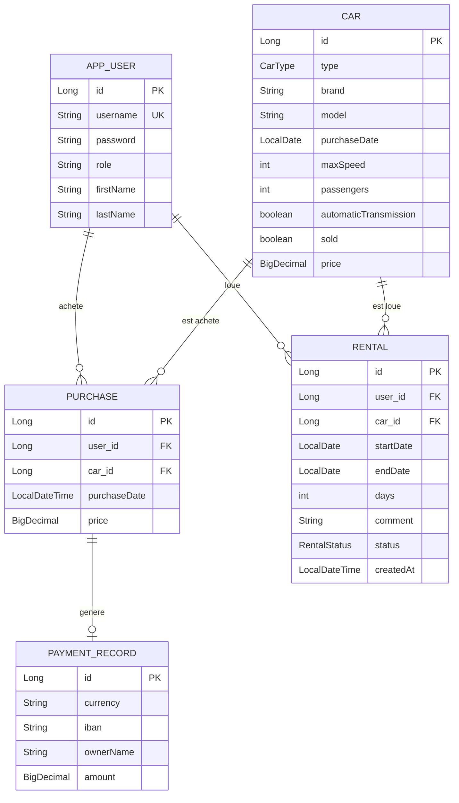

### Detail des relations

**`Purchase` → `AppUser`** : `@ManyToOne` — Un utilisateur peut faire plusieurs achats, mais chaque achat appartient a un seul utilisateur.
```java
@ManyToOne(fetch = FetchType.EAGER)
@JoinColumn(name = "user_id", nullable = false)
private AppUser user;
```

**`Purchase` → `Car`** : `@ManyToOne` — Chaque achat concerne une voiture. La colonne `car_id` est la cle etrangere.
```java
@ManyToOne(fetch = FetchType.EAGER)
@JoinColumn(name = "car_id", nullable = false)
private Car car;
```

**`Rental` → `AppUser`** : `@ManyToOne` — Un utilisateur peut faire plusieurs locations.
```java
@ManyToOne(fetch = FetchType.EAGER)
@JoinColumn(name = "user_id", nullable = false)
private AppUser user;
```

**`Rental` → `Car`** : `@ManyToOne` — Chaque location concerne une voiture.
```java
@ManyToOne(fetch = FetchType.EAGER)
@JoinColumn(name = "car_id", nullable = false)
private Car car;
```

**`Purchase` → `PaymentRecord`** : Liaison logique (pas de `@OneToOne` en base). Lors d'un achat, un `PaymentRecord` est cree automatiquement dans `PurchaseService` avec l'IBAN `"PURCHASE-{id}"`.

### Repositories (Spring Data JPA)

Les repositories heritent de `JpaRepository<Entity, ID>` qui fournit automatiquement les methodes CRUD (`findAll()`, `findById()`, `save()`, `deleteById()`, etc.) sans ecrire de SQL.

| Repository | Entite | Methodes personnalisees |
|---|---|---|
| `CarRepository` | `Car` | `findBySoldFalse()` — voitures disponibles |
| `AppUserRepository` | `AppUser` | `findByUsername(String)` — recherche par login |
| `PurchaseRepository` | `Purchase` | — (CRUD de base) |
| `RentalRepository` | `Rental` | — (CRUD de base) |
| `PaymentRecordRepository` | `PaymentRecord` | — (CRUD de base) |

> Spring Data JPA genere automatiquement les requetes SQL a partir du nom de la methode. Par exemple, `findBySoldFalse()` genere : `SELECT * FROM car WHERE sold = false`.

## Architecture globale

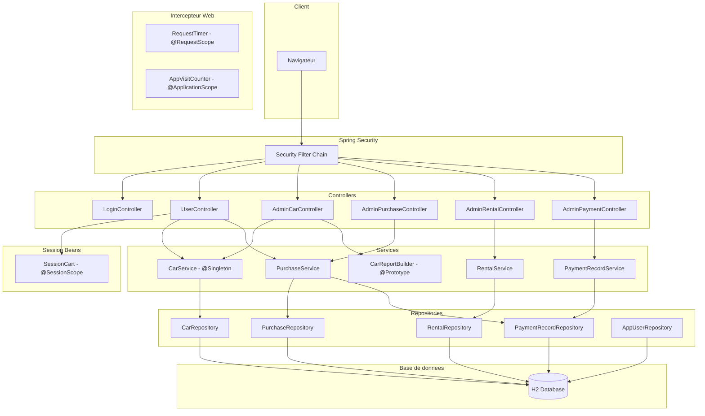

## Base de donnees

L'application utilise **H2 en mode fichier** (`./data/cardb`). Les donnees persistent entre les redemarrages.

Console H2 disponible sur : **http://localhost:8080/h2-console**
- JDBC URL : `jdbc:h2:file:./data/cardb`
- Utilisateur : `sa`
- Mot de passe : *(vide)*

## Structure du projet

```
src/main/java/com/examples/carcrud/
├── config/          # Configuration securite, intercepteur web, seeder
├── controller/      # Controleurs MVC (Admin, User, Login)
├── dto/             # Objets formulaire + CarReport
├── model/           # Entites JPA + beans scopes (SessionCart, RequestTimer, AppVisitCounter)
├── repository/      # Interfaces Spring Data JPA
└── service/         # Logique metier + CarReportBuilder (prototype)

src/main/resources/
├── static/css/      # Feuille de style
├── templates/       # Templates Thymeleaf
│   ├── fragments/   # Barres laterales (admin/user)
│   ├── admin/       # Pages admin (listes, formulaires, details, rapport)
│   └── user/        # Pages utilisateur (accueil, location, achat, panier)
└── application.properties
```

## Captures d'ecran

### Page de connexion


### Espace Utilisateur

| Page d'accueil | Location | Achat | Panier |
|:-:|:-:|:-:|:-:|
| 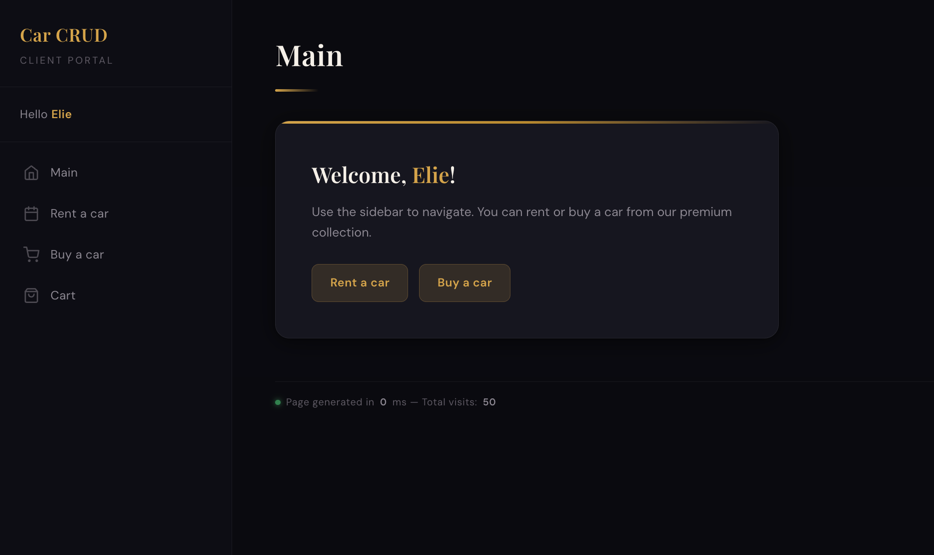 | 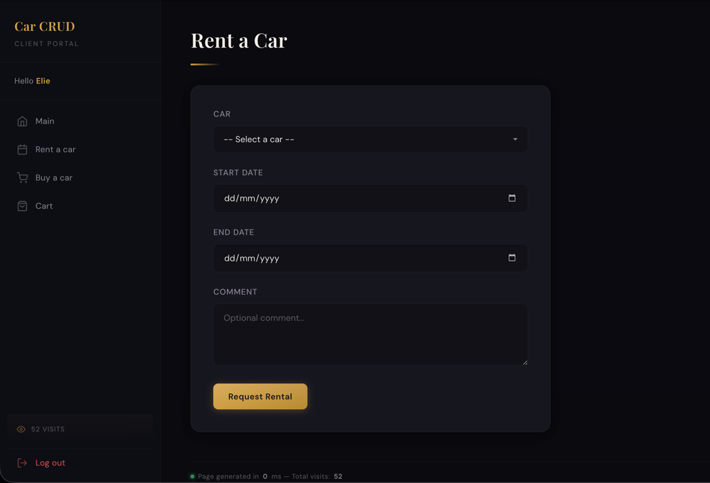 | 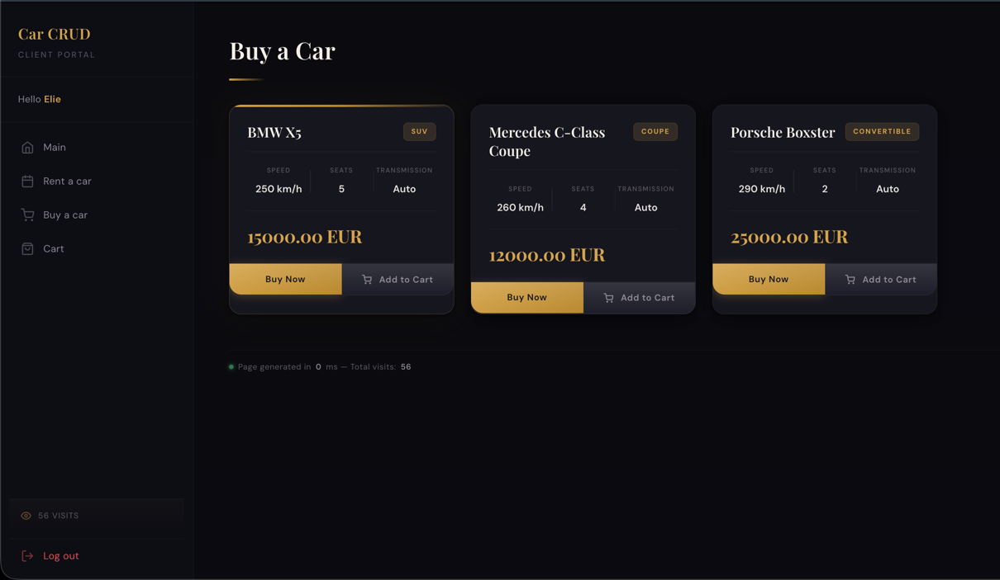 | 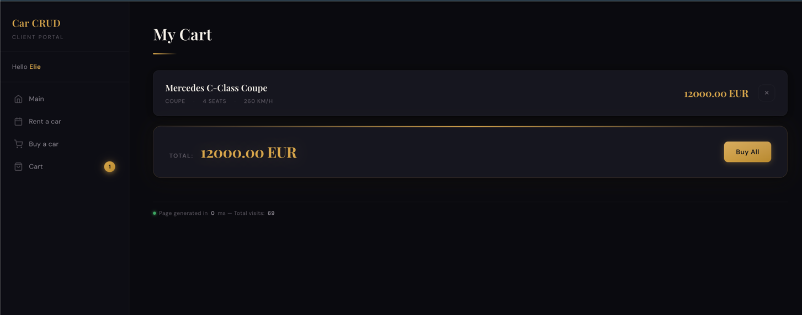 |

### Espace Administrateur

| Liste des voitures | Creer une voiture |
|:-:|:-:|
| 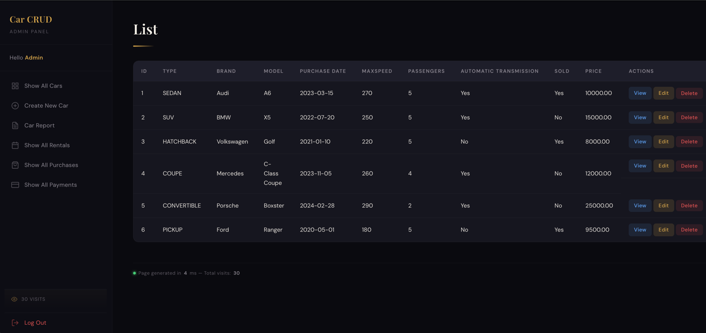 | 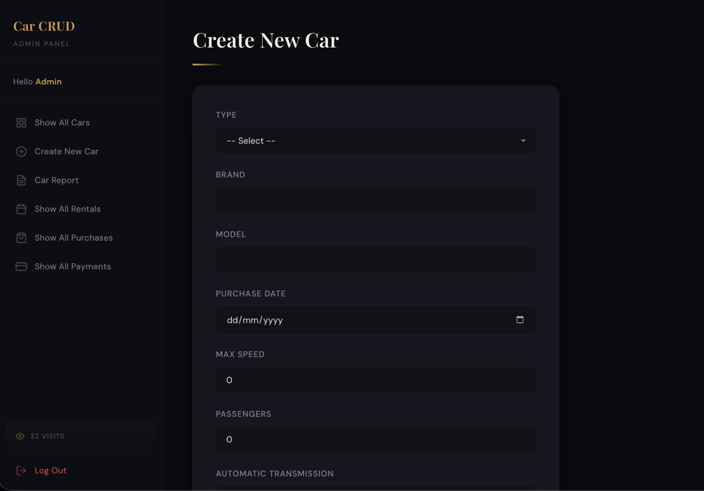 |

| Rapport d'inventaire | Liste des locations |
|:-:|:-:|
| 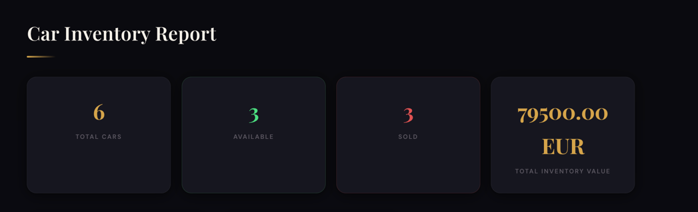 | 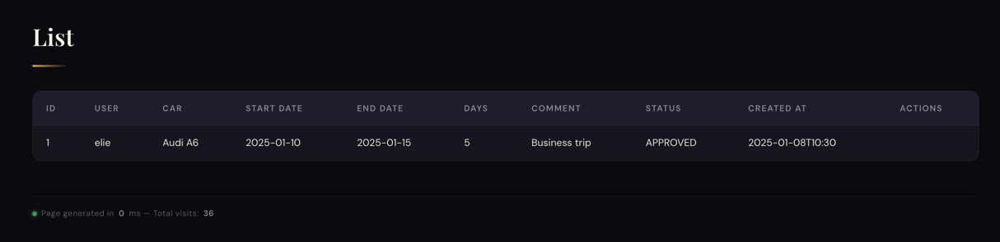 |

| Liste des achats | Liste des paiements |
|:-:|:-:|
| 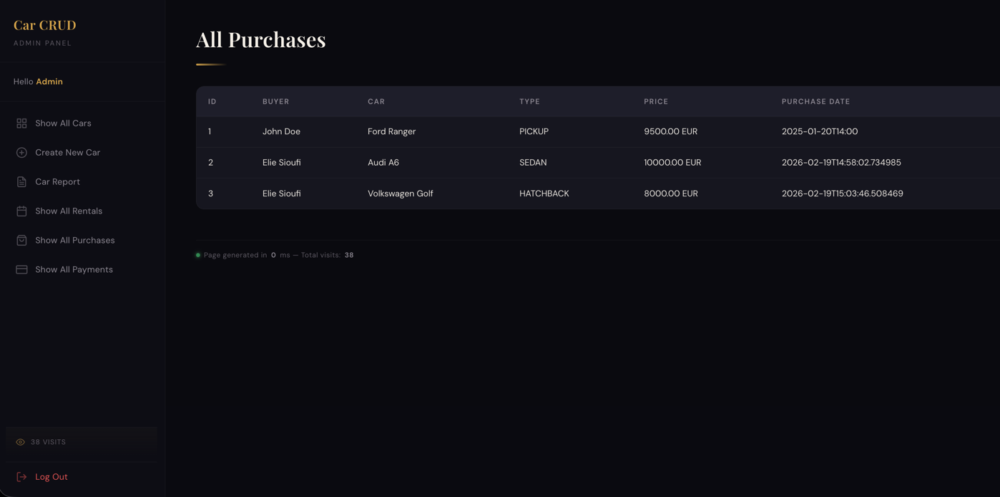 | 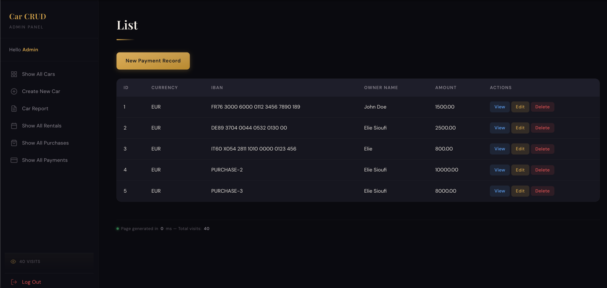 |
